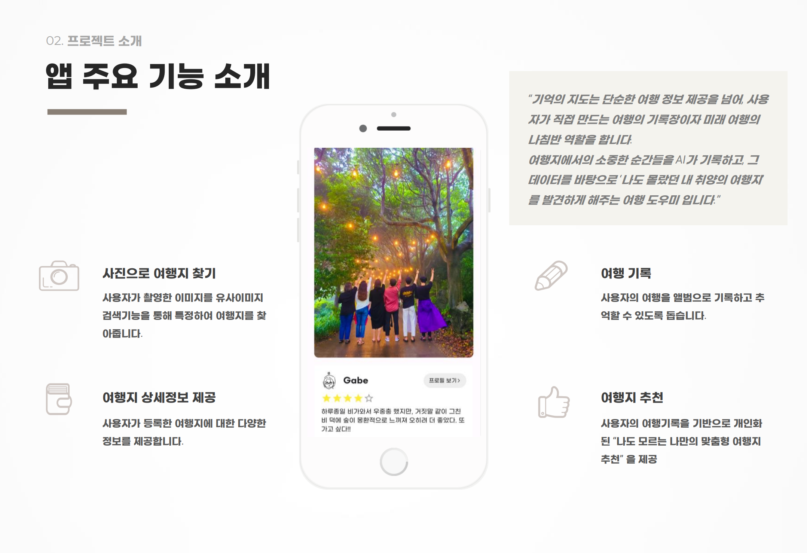
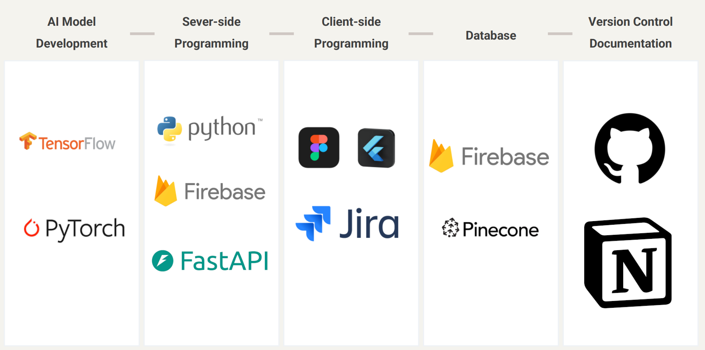
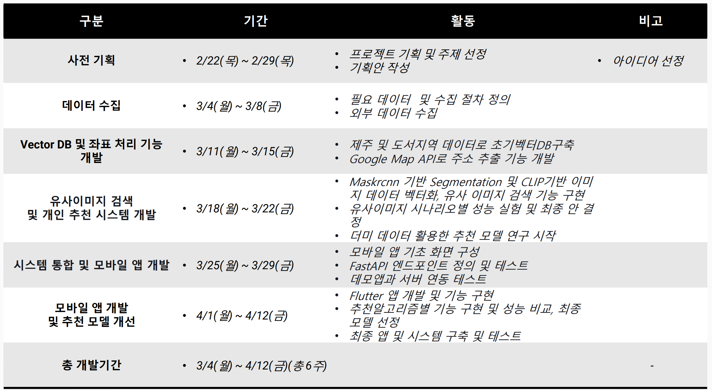

# AIFFEL_Final Project : 기억의 지도(NostalgiaNavi)
---
## 📌Intro.
- AIFFEL 에서 진행하는 교육과정의 마무리로 AI모델을 만든 뒤 플러터로 앱을 구현하는 최종 프로젝트를 수행했습니다.
- 총 6주간 앱 기획 및 제안서 작성, 아이디어 선정, 데이터 수집 및 전처리, AI모델링, Flutter 기반 앱 제작, 서버 연동 및 데모 엡 배포 의 과정을 수행 합니다.

 

- '기억의 지도(Nostalgianavi)' 는 사용자의 여행을 추억할 수 있도록 도우며, 그 기록들을 통해 새로운 여행지를 추천해주는 개인화된 여행 추천 앱 서비스 입니다.
- 기억의 지도에서 제공하는 기능은 하단의 이미지 4개와 같습니다.
    - 사진속 여행지 찾기
    - 사진속 여행지의 상세 정보 제공
    - 사용자의 여행 기록 기능 (별점, 일기)
    - 사용자 맞춤형 여행지 추천

 

- 기억의 지도는 벡터DB를 활용한 유사 이미지 검색 기술로 '사진속 관광지 찾기' 기능과 함께 한국관광공사의 TourAPI 데이터를 기반으로 관광지의 상세정보를 제공합니다.
- 또한, 사용자의 여행을 별점과 일기형태로 기록할 수 있게 하며, 이를 앨범 형태로 열람할 수 있게 제공 합니다.
- 수집된 개인의 여행기록은 LightGCN 을 커스터마이징한 LightGCN + POIMeta2Vec 모델을 통해 '개인화된 추천' 을 도출해 '나도 모르는 나의 취향일 수도 있는 여행지' 10곳을 도출해 추천합니다.

## 기술 스택

## 주차별 작업 내용

## App Demo
---
 [👉Appp Demo 영상 보러 가기](http://img.youtube.com/vi/7rO4qKwjE2k/0.jpg)

---

- 프로젝트를 사용하며 적용한 Git commit 컨벤션은 아래와 같습니다.

👈 Git commit 컨벤션 확인하기

| 커밋 유형 | 의미 |
| --- | --- |
| Feat | (어떤 유형이든) 파일의 최초 등록 시에 사용 |
| Model | 모델 구조변경 혹은 새로운 모델 추가 |
| Param | 하이퍼파라미터 수정 |
| Data | 데이터 전처리 방식 변경, 새로운 데이터 추가 |
| Metric | 평가지표 변경 |
| Train | 훈련과정 변경(Epoch수, Batch size 변경 등) |
| Eval | 검증/테스트 과정 변경 |
| Deploy | 모델 배포 관련 변경 |
| Fix | 버그 수정 (일반, ML/DL) |
| Docs | 문서 수정 (일반, ML/DL) |
| Style | 코드 formatting, 세미콜론 누락, 코드 자체의 변경이 없는 경우 |
| Refactor | 코드 리팩토링 (일반, ML/DL) |
| Test | 테스트 코드, 리팩토링 테스트 코드 추가 |
| Chore | 패키지 매니저 수정, 그 외 기타 수정 ex) .gitignore |
| Design | CSS 등 사용자 UI 디자인 변경 |
| Comment | 필요한 주석 추가 및 변경 (일반, ML/DL) |
| Rename | 파일 또는 폴더 명을 수정하거나 옮기는 작업만인 경우 |
| Remove | 파일을 삭제하는 작업만 수행한 경우 |
| !BREAKING CHANGE | 커다란 API 변경의 경우 |
| !HOTFIX | 급하게 치명적인 버그를 고쳐야 하는 경우 |

